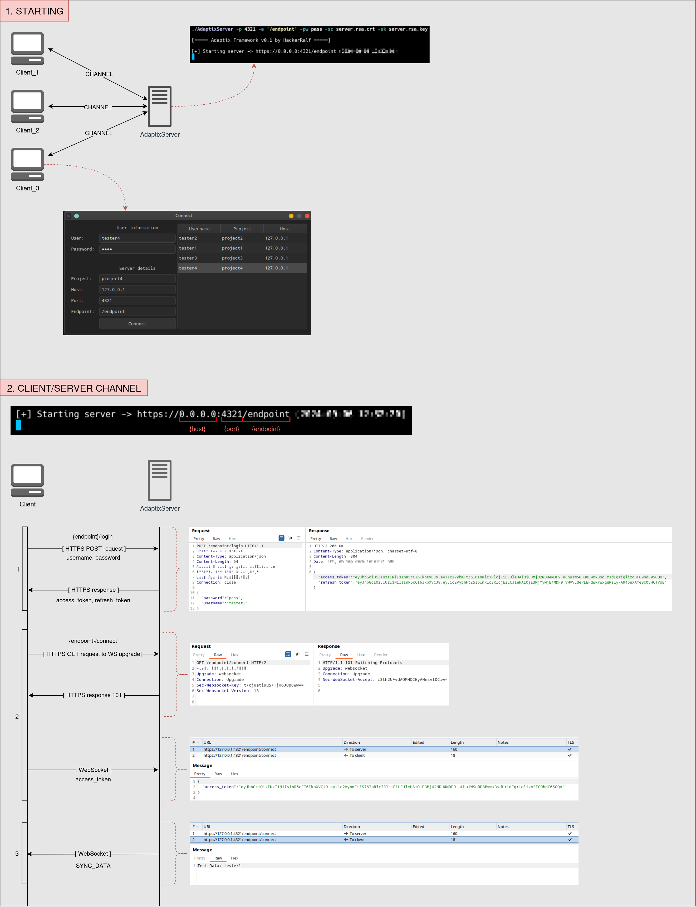

# Adaptix-Framework

Server build

```bash
# Pre Build
sudo apt install golang

# Build
cd AdaptixServer
CGO_ENABLED=0 go build -o adaptixserver
```

Client build

```bash
# Pre Build
sudo apt install cmake libssl-dev qt6-base-dev qt6-websockets-dev

# Build
cd Client
cmake .
make
```

### Adaptix client-server interaction diagram

